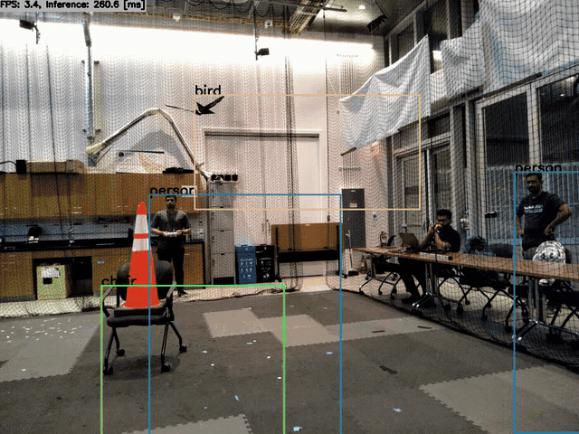
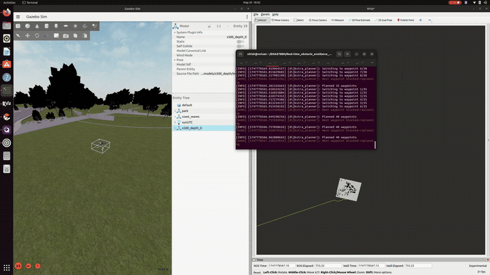

# Real-Time Object Tracking and Obstacle Avoidance for UAVs

An onboard ROS 2 prototype for a ModalAI VOXL-based UAV. It combines stereo depth, a local occupancy grid, Dijkstra path planning, and vision-based target following through PX4 offboard control. The system was developed and evaluated for the ENAE788M final project at the University of Maryland.

## Demos

**Indoor tracking and obstacle avoidance trial** (about 8 seconds, 4x speed):



**Planner simulation with a noisy point-cloud recording** (8 seconds, 4x speed):



The full methods, figures, results, and limitations are in the [final project report](ENAE788M_Final_Project.pdf).

## How it works

1. Calibrated stereo cameras and `voxl-dfs-server` produce depth and point clouds, bridged to ROS 2 by `voxl_mpa_to_ros2`.
2. An occupancy publisher filters point-cloud data, marks nearby obstacles in a 2D grid, and pads occupied cells for clearance. The publisher in this repository subscribes to `/voa_pc_out`; the final report describes a later front-stereo input (`/stereo_front_pc`) used for the evaluated grid. Check the topic in your deployed version before running it.
3. A Dijkstra planner routes through free cells and publishes `/planned_path` for visualization and `/fmu/in/trajectory_setpoint` for PX4 control.
4. Onboard object detections from `voxl-tflite-server` arrive on `/tflite_data`. The follower converts the selected target's bounding box into a moving goal on `/planner/goal`, which the integrated planner consumes.

The repository contains several development variants. `planner.py` demonstrates standalone path planning, while `test_planner_sub.py` accepts a follower goal for the combined pipeline. `test_follower_pub.py` publishes the goal expected by `test_planner_sub.py`. `object_follower.py` and `object_follower_tflite.py` publish setpoints directly to PX4 and are standalone follower variants.

## Requirements

- A ROS 2 workspace with `rclpy`, `sensor_msgs`, `nav_msgs`, `geometry_msgs`, `sensor_msgs_py`, `px4_msgs`, and `voxl_msgs` available.
- Python packages `numpy`, `scipy`, and `opencv-python` for the occupancy publisher and visualization.
- For onboard use: a configured ModalAI VOXL platform, calibrated stereo cameras, `voxl-dfs-server`, `voxl-tflite-server`, `voxl_mpa_to_ros2`, and PX4 offboard control.

## Run the ROS 2 nodes

Copy the scripts you plan to run into a ROS 2 Python package, make them executable, register them as package executables, and build/source the workspace. The package name and executable names below are examples; adapt them to your installation:

```bash
colcon build
source install/setup.bash
ros2 run px4_ros_com map_publisher.py
ros2 run px4_ros_com test_planner_sub.py
ros2 run px4_ros_com test_follower_pub.py
```

Check the live topics before enabling offboard control:

```bash
ros2 topic list
ros2 topic echo /occupancy_grid
ros2 topic echo /planned_path
```

Use RViz to display `/occupancy_grid` (`nav_msgs/OccupancyGrid`) and `/planned_path` (`nav_msgs/Path`). The `map_publisher.py` variant also opens an OpenCV occupancy-grid window, so it needs a graphical session.

## Results and limitations

The report documents object tracking in PX4 Gazebo simulation and indoor flight, and obstacle-aware path generation during indoor tests. The combined indoor experiment was less reliable: noisy stereo point clouds caused unstable occupancy grids, intermittent person detections caused goal loss, and high onboard CPU load reduced responsiveness. The report records collisions in that integrated trial. Treat this code as a research prototype, and validate sensing, planning, and failsafes before flight.

## License

MIT. See [LICENSE](LICENSE).
